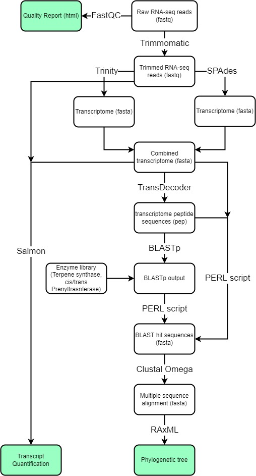

# Anisotome-RNA-seq
Contains a bioinformatics pipeline that was used to take raw RNA-seq reads from the plant Anisotome lyallii and convert them to a phylogenetic tree of relevant enzymes as well as transcript quantification.

Raw RNA-seq reads are too large to be uploaded to Github, but they are the only required inputs other than the BLAST libraries, all intermediates proceed from Raw RNA-seq reads in the fastq format.

Scripts are named by the program they use and by their tissue sample type. Forward and reverse reads cleaned by trimmomatic are then concatenated into master forward and reverse read files and put into both Trinity and SPAdes. The resulting transcriptome from both programs is then concatenated into a master query sequence used on all downstream analysis.

